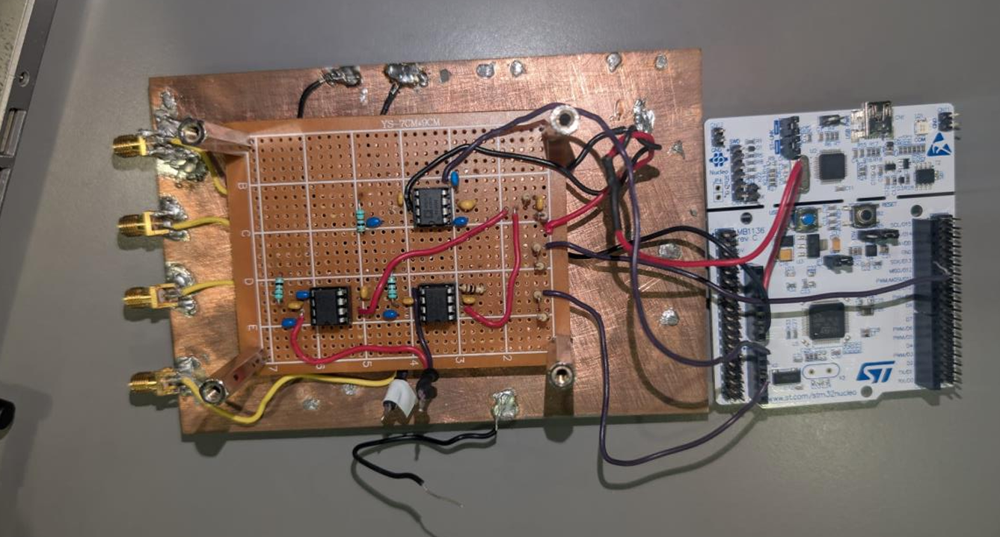

# Active Wideband Co-Site Interference Cancellation System

**Tactical VHF, 30–88 MHz** · Final year project, B.Sc. Electrical Engineering
Afeka Tel Aviv Academic College of Engineering

**Ronny Pustilnik · Adir Lemair** — Advisor: Tzvika Rosenblum

---

## What this is

A real-time active canceller for co-site interference: the problem where a
high-power transmitter sitting next to a receiver saturates its input stages
and blinds it completely.

The system taps a reference copy of the interferer, multiplies it by two
adaptive weights (I and Q) in an analog vector modulator to synthesise an
anti-phase replica, and subtracts that replica in a 180° combiner. An STM32
closes the loop at 30 kHz using a logarithmic RF power detector as its only
feedback.



## Measured results

| Metric | Target | Measured |
|---|---|---|
| Cancellation depth | ≥ 25 dB | **22.1 dB mean**, 28.6 dB peak, 13.6 dB worst across 30–88 MHz |
| Convergence, t(−15 dB) | < 10 ms | **1.9 ms mean**, 3.7 ms worst case |
| Desired-signal loss | ≤ 0.5 dB | **≤ 0.5 dB** down to 50 kHz separation |
| Combiner isolation ceiling | — | 21.1 dB (measured) |

Validated first as a MATLAB/Simulink digital twin, then built and measured in
hardware.

### Test 1 — across the band


Depth peaks at 28.6 dB near 50 MHz and falls toward the band edges, where the
fixed λ/4 line no longer delivers 90°.

### Test 2 — frequency separation


.PNG)

The wanted signal survives down to 50 kHz separation — a fractional bandwidth
of 0.00088, far beyond what any practical filter could resolve. This works
because cancellation is correlation-based, not frequency-based: the wanted
signal is absent from the reference, so no weight vector can cancel it.

### Test 3 — convergence


Logged inside the MCU at 30 kHz with a 1200-sample buffer, so the spectrum
analyser's sweep time never enters the measurement.

---

## Where to look — key code

### The control algorithm

| What | File | Why it matters |
|---|---|---|
| **The search itself** | [`B_Firmware_Source/canceller.c`](B_Firmware_Source/canceller.c) §7 | 8-way pattern search with momentum. Comparison-based rather than gradient-based — this is the core design decision. |
| Adaptive averaging | [`canceller.c`](B_Firmware_Source/canceller.c) §4 | Averages 1→16 readings as the null deepens. √N SNR gain converts directly into deeper reachable nulls. |
| Scale-invariant step law | [`canceller.c`](B_Firmware_Source/canceller.c) §5 | `Step = 0.20 · 10^(depth_dB/20)` — needs no retuning when signal levels change. |
| Tunables and state | [`B_Firmware_Source/canceller.h`](B_Firmware_Source/canceller.h) | Every constant with the reasoning behind its value. |
| **Full design rationale** | [`B_Firmware_Source/CODE_WALKTHROUGH.md`](B_Firmware_Source/CODE_WALKTHROUGH.md) | Start here. Explains *why* each choice was made, including three real bugs and their root causes. |

### Hardware interface

| What | File | Why it matters |
|---|---|---|
| Control loop tick | [`B_Firmware_Source/main.c`](B_Firmware_Source/main.c) → `HAL_TIM_PeriodElapsedCallback` | The 30 kHz ISR: read ADC, step the algorithm, write both DACs. |
| Damaged-channel compensation | [`main.c`](B_Firmware_Source/main.c) → `dac1_fix()` | DAC1 was physically damaged mid-project (inverted output, reduced span). Compensated in software rather than rebuilt. |
| Weight → voltage mapping | [`canceller.c`](B_Firmware_Source/canceller.c) → `canc_weight_to_dac()` | Calibrated around the *measured* VREF (0.682 V), not the theoretical 0.825 V. |
| Grid scan + convergence logger | [`B_Firmware_Source/console.c`](B_Firmware_Source/console.c) | `k` sweeps the I/Q plane; `g` dumps a per-tick log with time-to-threshold analysis. |

### Simulation

| What | File |
|---|---|
| Algorithm as a Simulink block | [`C_Simulation/canceller_fcn_LP_V17b.m`](C_Simulation/canceller_fcn_LP_V17b.m) |
| Model initialisation | [`C_Simulation/init_project_10ms_fast.m`](C_Simulation/init_project_10ms_fast.m) |
| Depth vs frequency sweep | [`C_Simulation/sweep_cancellation_vs_frequency.m`](C_Simulation/sweep_cancellation_vs_frequency.m) |
| Two-tone / power-ratio study | [`C_Simulation/sweep_twotone_separation.m`](C_Simulation/sweep_twotone_separation.m) |
| Delay-mismatch tolerance | [`C_Simulation/sweep_delay_mismatch.m`](C_Simulation/sweep_delay_mismatch.m) |

---

## Key equations

**Replica synthesis** — two multipliers span the whole amplitude/phase plane:

```
replica(t) = I · ref(t) + Q · ref(t − τ)      τ = 4.39 ns  (λ/4 at 57 MHz)
```

Any amplitude and any phase can be produced from those two numbers, which is
why the search space is only 2-dimensional.

**dB-domain measurement** — the AD8307 is logarithmic, so the ADC reading is
*already* a dB measure. No `log()` is ever computed:

```
P_dB = adc_counts × DB_PER_COUNT
DB_PER_COUNT = 0.02994   (calibrated in situ against a spectrum analyser)
```

**Scale-invariant step size** — relative to the captured baseline, so the same
tuning works at −20 dBm or +10 dBm:

```
TargetStep = 0.20 × 10^(depth_dB / 20)
```

---

## Repository layout

```
A_Schematic/            KiCad schematic, netlist, PDF
B_Firmware_Source/      STM32 firmware (C) + full documentation
C_Simulation/           MATLAB / Simulink model and sweep scripts
D_Measurement_Results/  Raw laboratory measurements
images/                 Measurement plots and hardware photo
```

Component datasheets are not included here — they are available from the
manufacturers (Analog Devices, Mini-Circuits, STMicroelectronics).

---

## Hardware

- **Vector modulator:** 2 × AD835 four-quadrant analog multipliers
- **Detector:** AD8307 logarithmic power detector (~25 mV/dB)
- **MCU:** STM32F446RE (NUCLEO-F446RE), 30 kHz control loop
- **RF:** Mini-Circuits ZFSC-2-1W-S+ splitter, ZFSCJ-2-1-S+ 180° combiner,
  three hand-built resistive splitters
- **Construction:** RF prototyping on a copper ground plane

---

## Known limitations

**The detector is wideband.** The AD8307 measures *total* in-band power and
cannot separate the residual interferer from the desired signal. Once the
residual falls below the wanted tone, the loop goes blind — so closed-loop
depth is capped at roughly the interferer-to-signal power ratio.

This was predicted in simulation and then confirmed on hardware. It is the
single clearest direction for future work: a frequency-selective detector
(a coherent correlator against the existing reference, or a mixer with a
narrow IF filter) would remove the limit entirely.

**The delay line is fixed.** A single λ/4 coaxial section is cut for one
design frequency, so cancellation depth degrades toward the band edges — from
28.6 dB at 50 MHz down to 13.6 dB at 88 MHz. A true-time-delay element would
give wideband cancellation instead.

---

## License

Academic project submitted for a B.Sc. degree at Afeka Tel Aviv Academic
College of Engineering, 2026.
